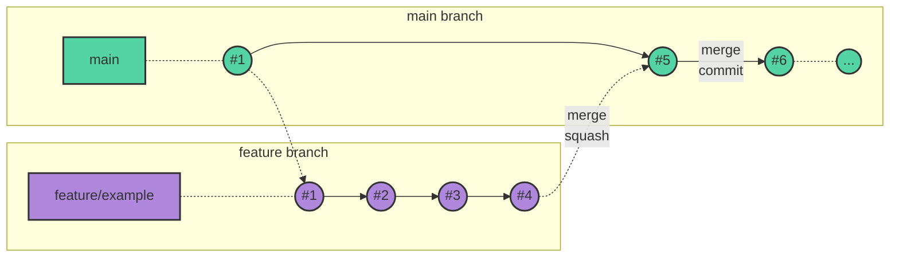

# Cómo contribuir al proyecto

## Tabla de contenidos

1) [Issues](#issues)
2) [Ramas](#ramas)
3) [Commits](#commits)
4) [Pull Requests](#pull-requests)
5) [Flujo de trabajo](#flujo-de-trabajo)
6) [Formato del código](#formato-de-código)
7) [Enlaces de interés](#enlaces-de-interés)

## Issues

En este proyecto, se utilizan las _issues_ como herramienta para proponer
cambios ([plantilla de _feature_](https://github.com/dfr99/SwimChrono/blob/main/.github/ISSUE_TEMPLATE/01-feature.md))
o para documentar errores encontrados en la aplicación ([plantilla de _bug_](https://github.com/dfr99/SwimChrono/blob/main/.github/ISSUE_TEMPLATE/02-bug.md)).

Una _issue_ estará asociada a una [_pull request_](#pull-requests), sobre la que
se harán los cambios que resuelvan la _issue_.

## Ramas

Este es el nombrado de las ramas a seguir en el repositorio:

* `main`: Es la rama principal, base para todas las demás ramas. Sobre ella se
crean los tags correspondientes a cada una de las entregas parciales. Es la
única rama de larga duración
* `feature/`: Prefijo para las ramas que añaden nuevas funcionalidades o
modifican las ya existentes.
* `bug/`: Prefijo para las ramas destinadas a corrigir fallos.
* `docs/`: Prefijo para las ramas que solo incluyen actualizaciones en la
documentación.

Además de esto, el nombre de la rama incluirá el prefijo `GH`, seguido del
número de la _issue_ asociada, separado con un guión. Por ejemplo, si los
cambios añaden una nueva funcionalidad y están asociados a la issue número 1, el
nombre de la rama sería `feature/GH-1`

## Commits

Los _commits_ son el elemento más básico de sistema de control de versiones Git.
Su uso correcto facilita el mantenimiento y la revisión en los repositorios.
A continuación, se lista una serie de recomendaciones sobre los _commits_:

* Los _commits_ deben de estar [firmados](https://docs.github.com/es/authentication/managing-commit-signature-verification/signing-commits)
* Los mensajes de los _commits_ deben ser claros y concisos.
* Los _commits_ deben de ser [atómicos](https://www.aleksandrhovhannisyan.com/blog/atomic-git-commits/)
* Se recomienda utilizar [_conventional commits_](https://www.conventionalcommits.org/en/v1.0.0/)

## Pull requests

En este proyecto, seguiremos la relación 1:1 entre _issues_ y _pull requests_.
Teniendo esto en cuenta, a continuación, se listan algunas directrices a la
hora de crear, revisar y mergear _pull requests_:

* Definir correctamente los campos de la PR:
  * La rama destino **SIEMPRE**  debe de ser la rama `main`.
  * Titulo descriptivo, siendo válido utilizar el mismo que el de la _issue_
  siempre y cuando la PR cierre esa issue.
  * Añadir `Closes #<numero_de_issue>` en la descripción para cerrar la _issue_
    automáticamente tras cerrar la PR.
  * Asignar la PR al usuario que vaya a realizar los cambios. Añadir un revisor,
    que debe ser el encargado de la sección a la que pertenece la _issue_
    asociada.
  * Añadir las etiquetas adecuadas a la PR
  * **NO** enlazar la PR a un proyecto, se enlaza únicamente la _issue_.
* Utilizar el [_squash merge_](https://graphite.dev/guides/git-merge-squash)
para no ensuciar la rama `main` con excesivos commits.
* Aquella persona asignada a la PR es quien debe mergear los cambios.
* Antes de mergear los cambios, el revisor tiene que cerrar todos los hilos de
discusion abiertos, así como aprobar la PR.
* En caso de que se ejecuten _workflows_, tienen que ejecutarse con éxito antes
de mergear.
* Asegurarse de que la rama está actualizada con main antes de mergear.

## Flujo de trabajo

El flujo de trabajo utilizado en este proyecto es [**Trunk-based development**](https://trunkbaseddevelopment.com/).
Se ha escogido este flujo de trabajo debido a que, al generar un tag de
"release" cada semana y ser un proyecto relativamente pequeño, nos parece el
modelo más apropiado.

En este apartado, se explica cómo sería el flujo de trabajo de un desarrollador
para contribuir a este proyecto paso a paso:

1) Creación de una issue para exponer la tarea a realizar (ver el apartado [**Issues**](#issues)).
2) Creación de una rama, con el nombre correcto (ver el apartado [**Ramas**](#ramas)).
3) Realización de los cambios y subida de la rama al repositorio remoto.
4) Creación de la Pull Request (ver el apartado [**Pull requests**](#pull-requests)).
5) _Peer reviewing_ por parte del revisor de la PR.
6) Una vez el revisor aprueba la PR, cerrar, mergear y borrar la rama
con los cambios.

## Formato del código

En este proyecto, la identación de los ficheros se hace utilizando espacios,
con un ancho de 2 espacios para cada nuevo nivel. Aquellos cambios que incluyan
tabulaciones.

Con respecto a la validación del código, a continuación, se muestra la lista de
_linters_ utilizados en los ficheros del proyecto:

* YAML:
  * [yamllint](https://yamllint.readthedocs.io/en/stable/)
* Markdown:
  * [markdownlint](https://github.com/markdownlint/markdownlint)

## Enlaces de interés

* [Listado de commits](https://github.com/dfr99/SwimChrono/commits)
* [Listado de ramas](https://github.com/dfr99/SwimChrono/branches)
* [Issues abiertas](https://github.com/dfr99/SwimChrono/issues)
* [PRs abiertas](https://github.com/dfr99/SwimChrono/pulls)
