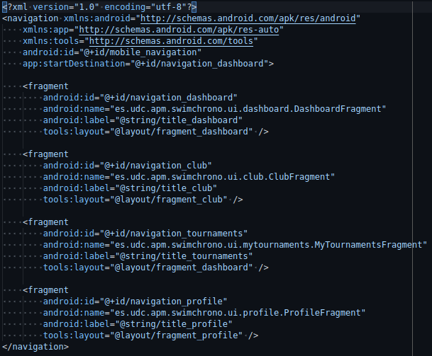

# Elección de los componentes

## Actividades

<!--  Intro -->

En nuestra aplicación _SwimChrono_ se han implementado las siguientes actividades por donde el usuario podrá navegar.


<!--  Actividad principal -->

### MainActivity

En el MainActivity se ha decidido implementar una pantalla principal en nuestra aplicación para que el usuario pueda ver los fragmentos que se explicarán en el siguiente apartado. Esta actividad contiene en la parte inferior una barra de navegación (*navigation_bar*) donde poder cambiar de fragment a otro sin salir del menú principal.

<!-- Cada unha das opcións de perfil -->
### Actividades Profile

Estas son las actividades utilizadas para configurar los datos del usuario:

- Pantalla de _Información personal_
- Pantalla de _Mi QR_
- Pantalla de _Notificaciones_
- Pantalla de _Configuración_


<!-- Cronómetro... para más adelante XD-->

## Fragmentos

En la aplicación _SwimChrono_ se han decidido implementar las pantallas
principales de la aplicación como fragmentos, siendo cada pantalla un fragmento:

- Pantalla de _Próximos Torneos_
- Pantalla de _Mis Torneos_
- Pantalla de _Mi Club_
- Pantalla de _Mi Perfil_

Estos fragmentos son utilizados por la actividad principal, que dispone de un
_navController_ para gestionar la navegación entre y la disposición de las
pantallas en el menú principal de la aplicación.



El equipo ha optado por esta solución por los siguientes motivos:

- El uso de fragmentos favorece la **reutilización** y **modularidad** de los
recursos.
- Con la utilización de fragmentos, es posible comunicarse con la actividad
anfitriona sin necesidad de crear componentes adicionales, como los _Intents_.
Además, estos fragmentos, al estar contenidos dentro de la misma actividad, se
podrían llegar a comunicar entre ellos.
- La gestión de los estados de los fragmentos es más precisa y controlada en
comparación con la gestión de los estados de las actividades

Esta solución también presenta inconvenientes, que se detallan a continuación:

- La gestión de los estados, a pesar de ser más precisa que con el uso de
actividades, se vuelve más compleja al tener que ser manejada explícitamente
por los desarrolladores, con el uso de la función [_addToBackStack()_][backstack].
- El ciclo de vida de los fragmentos depende de la actividad anfitriona, mientras
que las actividades son independientes y tienen sus propio ciclo de vida.

## Servicios

<!-- Acceso a API como servicio-->
Para la comunicación con la API que ofrece el backend donde se guardan los datos de los nadadores, entrenadores, clubes y competiciones, se ha optado por implementar un servicio en la aplicación SwimChrono. Este servicio se encargará de realizar las llamadas a la API y manejar los datos devueltos.

### Implementación del Servicio

El servicio ApiService se implementará como un componente de la aplicación que manejará las operaciones de red relacionadas con la gestión de nadadores. Este servicio se encargará de enviar y recibir datos desde la API de nadadores y manejará la lógica relacionada con las llamadas HTTP.

### Funcionalidades del Servicio

El servicio ApiService incluirá los siguientes métodos para interactuar con la API de nadadores:

- GET /torneos: Este método realizará una solicitud GET a la API para obtener la lista de torneos con la información detallada de las pruebas que se realizarán. También se obtendrá la información de los nadadores asignados a dichas carreras.
- GET /nadadores/{id}: Este método realizará una solicitud GET a la API para obtener los datos relevantes de dicho nadador. También se obtendrán los datos de los torneos próximos que tiene asignados.
- GET /clubes: Este método realizará una solicitud GET a la API para obtener la lista de clubes. Contará con la información de los nadadores y los entrenadores que se encuentran asociados a dicho club.
- PUT /prueba/{id}: Este método realizará una solicitud PUT a la API la cual actualizará los tiempos de las pruebas realizadas a través de la aplicación.

Cabe destacar que estos métodos no son definitivos pues será necesario definir y desplegar una API RESTful para simular el funcionamiento correcto de la aplicación.

### Uso del servicio

El servicio ApiService será lanzado desde diversos puntos de la aplicación, según sea necesario. Por ejemplo, cuando un fragmento requiera datos de la lista de nadadores, puede iniciar el servicio para realizar una llamada GET a la API. De manera similar, cuando se agregue un nuevo tiempo desde la vista del cronómetro se hará una llamada PUT a la API que actualizará el tiempo cronometrado.

### Uso de los Datos Recibidos

Una vez que el servicio ApiService reciba los datos de la API de nadadores, los procesará según sea necesario. Por ejemplo, si se recibe una lista de nadadores en respuesta a una solicitud GET, el servicio puede procesar estos datos y enviarlos de vuelta al fragmento solicitante para su visualización en la interfaz de usuario.

Este enfoque permite separar las operaciones de red de la lógica de la interfaz de usuario, lo que hace que el código sea más modular y fácil de mantener.

A continuación se muestra un código _boilerplate_ de la posible implementación del servicio en la aplicación. Se muestra la llamda de getNadadores() que es la encargada de obtener la lista de todos los nadadores.

```kotlin
class ApiService : Service() {

    override fun onBind(intent: Intent?): IBinder? {
        return null
    }

    override fun onStartCommand(intent: Intent?, flags: Int, startId: Int): Int {
        when (intent?.action) {
            ACTION_GET_NADADORES -> getNadadores()
            ACTION_POST_NADADOR -> {
                val nadador = intent.getStringExtra(EXTRA_NADADOR)
                postNadador(nadador)
            }
            else -> Logger.error(TAG, "Acción no válida")
        }
        return START_NOT_STICKY
    }

    private fun getNadadores() {
        CoroutineScope(Dispatchers.IO).launch {
            try {
                val url = URL("https://swimchrono-api.url/nadadores")
                val connection = url.openConnection() as HttpURLConnection
                connection.requestMethod = "GET"

                val responseCode = connection.responseCode
                if (responseCode == HttpURLConnection.HTTP_OK) {
                    val inputStream = connection.inputStream
                    val response = inputStream.bufferedReader().use { it.readText() }
                    inputStream.close()
                    Logger.debug(TAG, "Response: $response")
                } else {
                    Logger.error(TAG, "Error en la respuesta: $responseCode")
                }
            } catch (e: Exception) {
                Logger.e(TAG, "Error al realizar la solicitud GET", e)
            }
        }
    }

    companion object {
        private const val TAG = "ApiService"
        const val ACTION_GET_NADADORES = "com.example.app.GET_NADADORES"
    }
}

```
<!-- Variables -->
[backstack]: https://developer.android.com/reference/androidx/fragment/app/FragmentTransaction#addToBackStack(java.lang.String)
