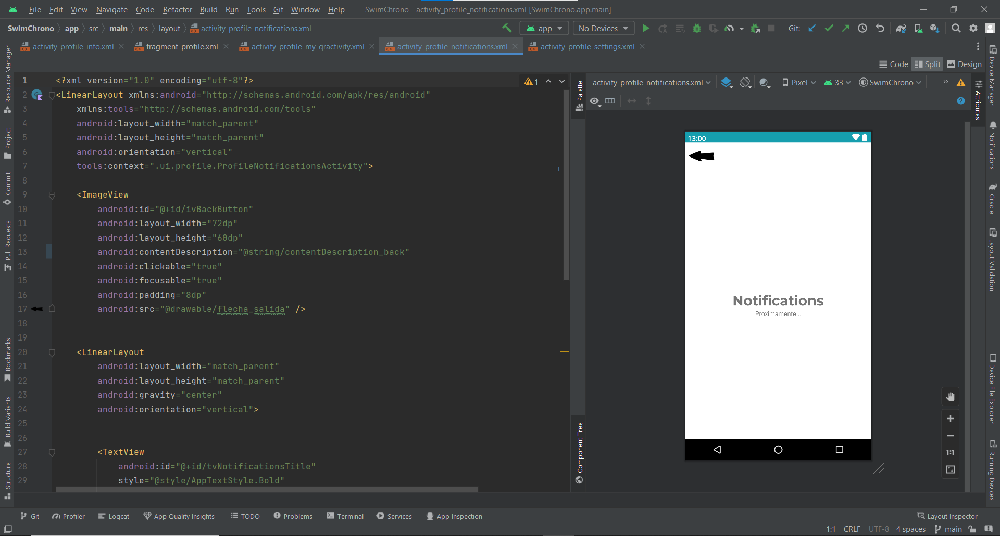
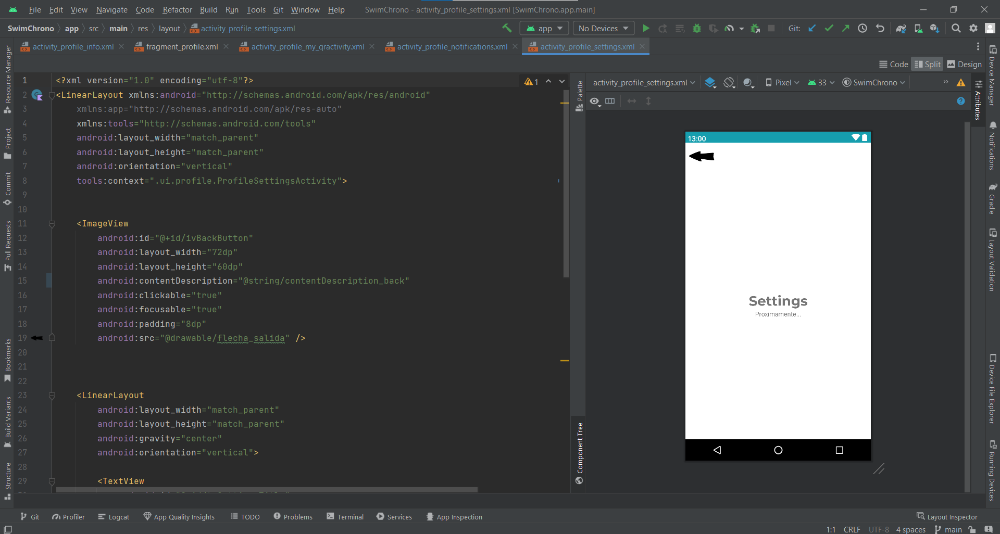

# Implementación de los wireframes

## Wireframes de los principales casos de uso

A continuación, se presentan las primeras implementaciones de los casos de uso que tiene la aplicación.

### 1. Dashboard / Torneos

### 2. Mi Club

### 3. Cronometrador Oficial

### 4. Mi Perfil

