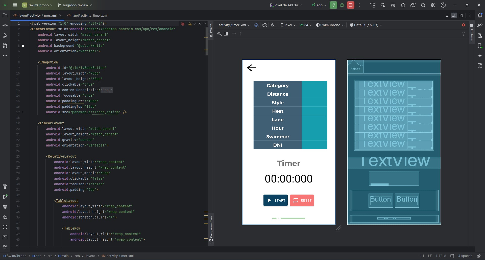
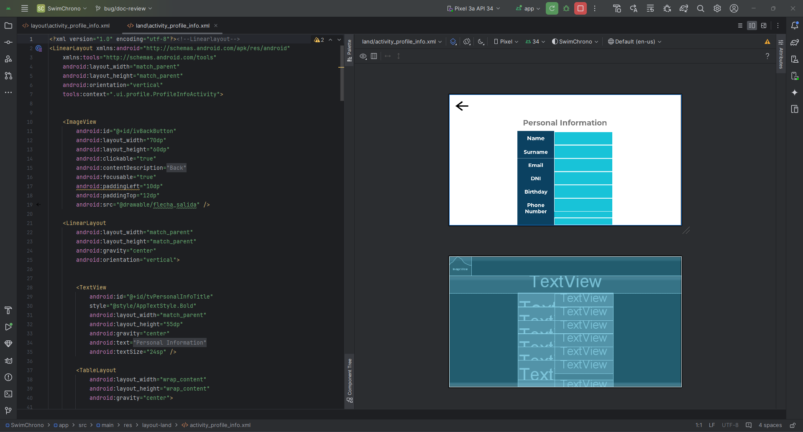
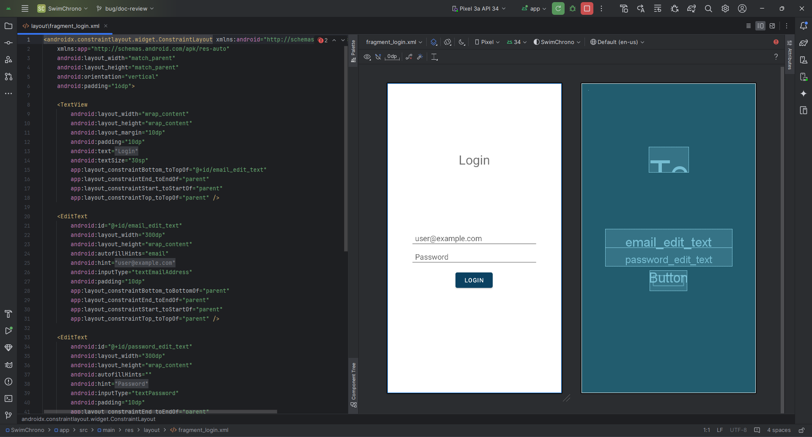
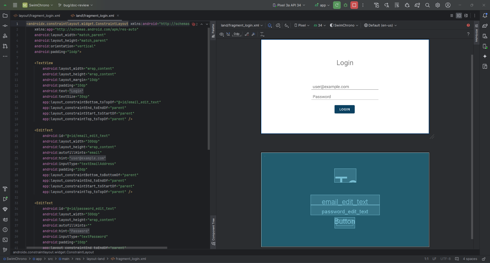

# Implementación de los wireframes

## Wireframes de los principales casos de uso

A continuación, se presentan las primeras implementaciones de los casos de uso que tiene la aplicación.

### 1. Dashboard / Torneos

#### Disposición vertical

#### Disposición horizontal

### 2. Mi Club

#### Disposición vertical

#### Disposición horizontal

### 3. Cronometrador Oficial

#### Disposición vertical

#### Disposición horizontal

### 4. Mi Perfil

#### Disposición vertical

##### Pantalla principal de ajustes

##### Información personal

##### QR Personal

Destacar que el QR se genera dinámicamente para cada usuario tras el login en la aplicación

##### Sección de más ajustes

#### Disposición horizontal

##### Pantalla principal de ajustes

##### Información personal

##### QR Personal

Destacar que el QR se genera dinámicamente para cada usuario tras el login en la aplicación

##### Sección de más ajustes

### 5. Pantalla de login

#### Disposición vertical

#### Disposición horizontal

