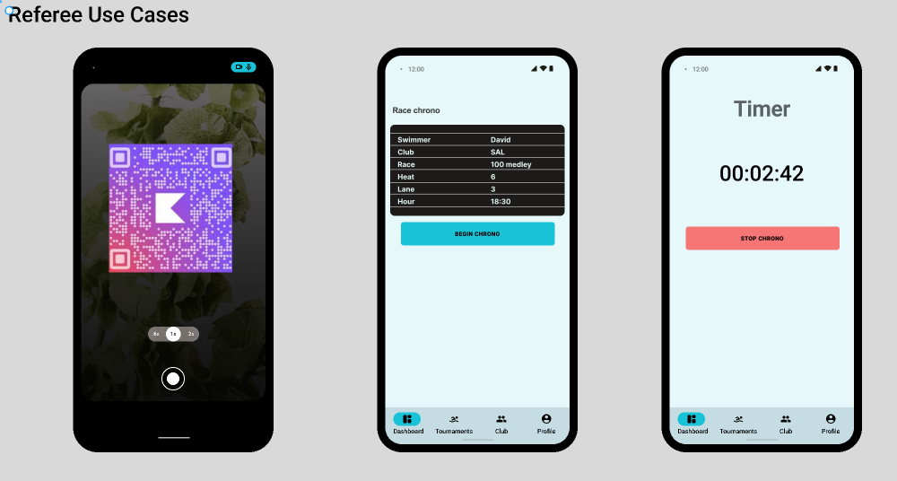

# Wireframes

A continuación, se presentan los bocetos de las diferentes pantallas de la aplicación.

## 1. Dashboard / Torneos

En esta sección, los **usuarios no logeados** podrán ver una visión general de los torneos actuales y próximos. También podrán acceder a más detalles sobre cada torneo.

## 2. Mis Torneos

Aquí, los **nadadores** podrán ver los torneos en los que están inscritos y acceder a información detallada sobre cada uno de ellos.

## 3. Mi Club

En esta pantalla, los **nadadores y entrenadores** podrán explorar información sobre su club, incluyendo miembros, eventos y estadísticas relevantes.

## 4. Cronometrador Oficial

Esta sección estará destinada a los **cronometradores oficiales** para registrar y gestionar los tiempos de los participantes en los eventos.

## 5. Mi Perfil

Aquí, los usuarios podrán ver su perfil personal, incluyendo información de contacto, preferencias y estadísticas personales, incuyendo la visualización de un QR único.

