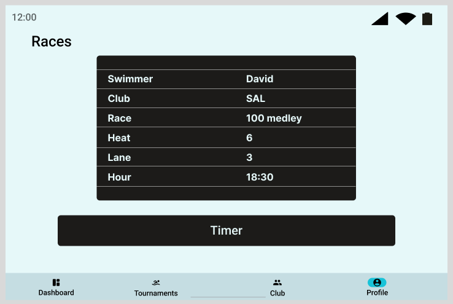
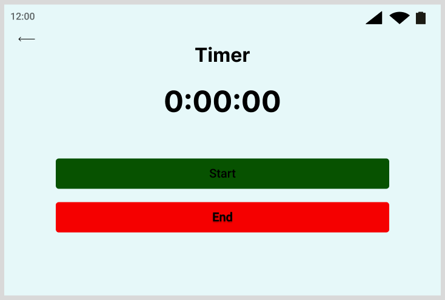
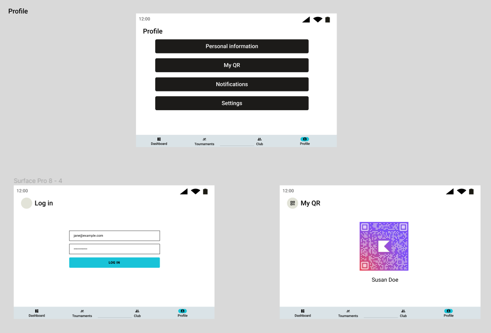

# Wireframes

## Hoja de estilos

Para la creación de los siguientes wireframes se ha seguido una paleta de colores sencilla, en la que se define los colores de la aplicación junto con la tipografía que se va a utilizar.

## Wireframes de los principales casos de uso

A continuación, se presentan los bocetos de las diferentes pantallas de la aplicación.
Se muestran tanto las pantallas

### 1. Dashboard / Torneos

En esta sección, los **usuarios no logeados** podrán ver una visión general de los torneos actuales y próximos. También podrán acceder a más detalles sobre cada torneo.

#### Disposición en vertical

#### Disposición en horizontal

### 2. Mis Torneos

Aquí, los **nadadores** podrán ver los torneos en los que están inscritos y acceder a información detallada sobre cada uno de ellos.

### 3. Mi Club

En esta pantalla, los **nadadores y entrenadores** podrán explorar información sobre su club, incluyendo miembros, eventos y estadísticas relevantes.

#### Disposición en vertical

#### Disposición en horizontal

### 4. Cronometrador Oficial

Esta sección estará destinada a los **cronometradores oficiales** para registrar y gestionar los tiempos de los participantes en los eventos.

#### Disposición en vertical

#### Disposición en horizontal

### 5. Mi Perfil

Aquí, los usuarios podrán ver su perfil personal, incluyendo información de contacto, preferencias y estadísticas personales, incuyendo la visualización de un QR único.

#### Disposición en vertical

#### Disposición en horizontal

