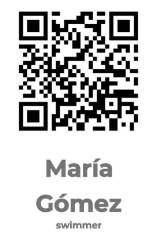

# Guía de usuario/evaluación

## 1. Consola de Firebase

La aplicación utiliza [Firebase](https://console.firebase.google.com/) como su backend, aprovechando FirebaseDatabase para almacenar datos y FirebaseAuth para la autenticación de usuarios.

Para acceder a la consola de firebase se debe utilizar la siguiente cuenta de Google.

Email: <swimchrono@google.com>

Password: **swimchronoadmin**

Nombre del proyecto: **swimchrono-8b020**

### 1.1 FirebaseDatabase

FirebaseDatabase se utiliza para almacenar y gestionar la información de los torneos y carreras. La estructura principal incluye:

- **Tournaments**: Cada torneo tiene un ID único y contiene múltiples carreras.
  - **Carreras**: Cada carrera dentro de un torneo contiene detalles como la categoría, distancia, estilo, calor, carril y hora.
- **Usuarios**: Cada usuario tiene información relevante y el UID que se utiliza para la Autenticación con Firebase Auth. También cuenta con los roles de los usuarios.
- **Clubes**: Cada club tiene la información relevante del club y los miembros que pertenecen al club.

#### Estructura de la base de datos: Apartado de torneos

```json
{
  "tournaments": [
    {
      "id": 1,
      "nombre": "Torneo de natación Lugo 2024",
      "fecha": "15 Apr 2024",
      "lugar": "Piscina Municipal de Lugo",
      "num_participantes": 50,
      "tipo": "Local",
      "carreras": [
        {
          "id": 1,
          "categoria": "Masculino",
          "distancia": "50 metros",
          "estilo": "Libre",
          "heat": 1,
          "lane": 1,
          "hour": "15:00:00",
          "tiempos": {
            "hODQVACxIVVomwj7Fa5C23js9622": "00:00:000"
          }
        },
        {
          "id": 2,
          "categoria": "Femenino",
          "distancia": "100 metros",
          "estilo": "Espalda",
          "heat": 1,
          "lane": 1,
          "hour": "15:00:00"
        },
        {
          "id": 3,
          "categoria": "Mixto",
          "distancia": "200 metros",
          "estilo": "Mariposa",
          "heat": 1,
          "lane": 1,
          "hour": "15:00:00"
        }
      ]
    }
  ]
}

```

La aplicación muestra datos de torneos del propio día y de días futuros. Es importante para poder probar correctamente que se comprueben los datos de los torneos si llegara el caso de no poder ver ningún torneo.

### 1.2 FirebaseAuth

FirebaseAuth se utiliza para gestionar la autenticación de usuarios, permitiendo el inicio de sesión mediante correo electrónico y contraseña. Esto asegura que solo usuarios autorizados puedan acceder a las funcionalidades de la aplicación.

### 2. Login de la App

La pantalla de inicio de sesión es la primera interacción del usuario con la aplicación. Los usuarios deben ingresar su correo electrónico y contraseña para acceder.

Se proporcionan las siguientes cuentas que permiten acceder a los roles que existen dentro de la aplicación.

### La contraseña para todos ellos es **abc123**

 Administrador:

- <admin@email.com> (NOTA: La finalidad de esta cuenta es poder ejercer de todos los roles sin necesidad de andar cambiando de cuenta)

 Árbitros:

- <referee@email.com>
- <referee2@email.com>
- <referee3@email.com>

 Entrenadores:

- <trainer@email.com>
- <trainer2@email.com>
- <trainer3@email.com>

 Nadadores:

- <swimmer@email.com>
- <swimmer1@email.com>
- <swimmer2@email.com>
- <swimmer3@email.com>
- <swimmer4@email.com>
- <swimmer5@email.com>

### 3. Apartado Árbitro

El árbitro es el encargado de realizar las mediciones de tiempos a los nadadores. Para ello utiliza un QR único de cada nadador y selecciona de una lista de un torneo la carrera a la que quiere asignar ese nadador.

### 3.1 Roles y QR's

- Asignación de roles: Se hace manualmente en la consola de Firebase.
- Generación de QR Codes: Cada usuario tiene un QR unívoco.
- Escaneo de QR Codes: Los árbitros pueden escanear QR codes para guardar los datos del nadador en la carrera que nada.

Los siguientes QR's son para que un árbitro los utilice para guardar los tiempos:

- Swimmer1:

    

- Swimmer2:

    

### 4. Demás apartados

Los demás apartados no requieren mucha explicación por ser muy intuitivos. Permite observar los torneos y las carreras que contienen y también la información relevante al club de un nadador.

## Finalidad de la aplicación

Esta aplicación está diseñada para gestionar tiempos en carreras de torneos y ofrecer información de dichos tiempos y torneos en tiempo real. Para ello utiliza Firebase para una gestión robusta de la base de datos y autenticación. La funcionalidad de validación de usuarios y verificación mediante QR codes proporciona un nivel adicional de seguridad y organización, especialmente útil para eventos deportivos.

### Funcionalidades Clave

- Gestión de torneos y carreras.
- Consulta de usuarios y clubes.
- Autenticación de usuarios(entrenadores, nadadores y árbitros).
- Asignación y verificación de roles de árbitros mediante QR codes.

Esperamos que esta explicación te haya proporcionado una visión clara de las capacidades y funcionalidades de la aplicación. Para cualquier pregunta adicional, no dudes en contactarnos.
