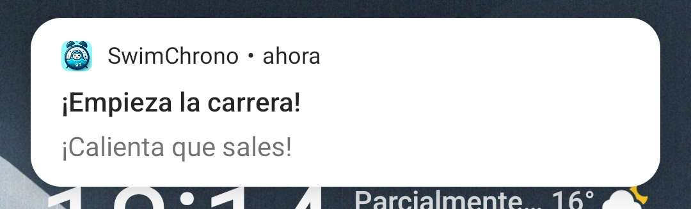
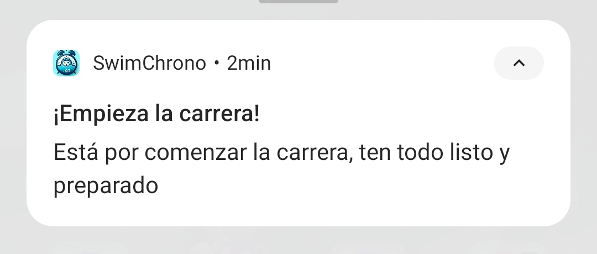

# Notificaciones

En la aplicación se implementa un sistema de notificaciones para informar del usuario sobre cuando inicia la carrera en donde se apunta. Se crean notificaciones un día antes, una hora antes y cuando comienza la carrera.

Para manejar el uso de las notificaciones se crean las siguientes clases:

## AlarmNotification

La clase *AlarmNotification* extiende *BroadcastReceiver* y se encarga de recibir y manejar la notificación programada. Cuando se dispara la alarma, se crea y muestra una notificación al usuario, incluyendo un título, un texto de contenido (descripción breve) y una descripción de texto expandida. A continuación se muestran imágenes de las notificaciones.

*Notificación emergente con descripción breve*

*Notificación en tablón de notificaciones con texto descripción de texto expandida*

## AlarmNotificationManager

En esta clase se gestiona la programación de las notificaciones. Se encarga de crear un canal de notificaciones, almacenar la fecha y hora de la carrera en SharedPreferences para poder ser usado por el *BootReceiver*, y programar una alarma en el AlarmManager que disparará la notificación en el momento que empiece la carrera.

## BootReceiver

En esta clase se implementa la capacidad de reprogramar la alarma de notificación de la carrera una vez que el dispositivo se haya vuelto a encender. Para ello se usa un componente *BootReceiver*, que es un receptor de broadcast que escucha el evento de finalización del arranque del sistema. Cuando el dispositivo se reinicia, *BootReceiver* recupera la fecha y hora de la carrera desde *SharedPreferences* y vuelve a programar la alarma si la carrera no ha empezado todavía.
