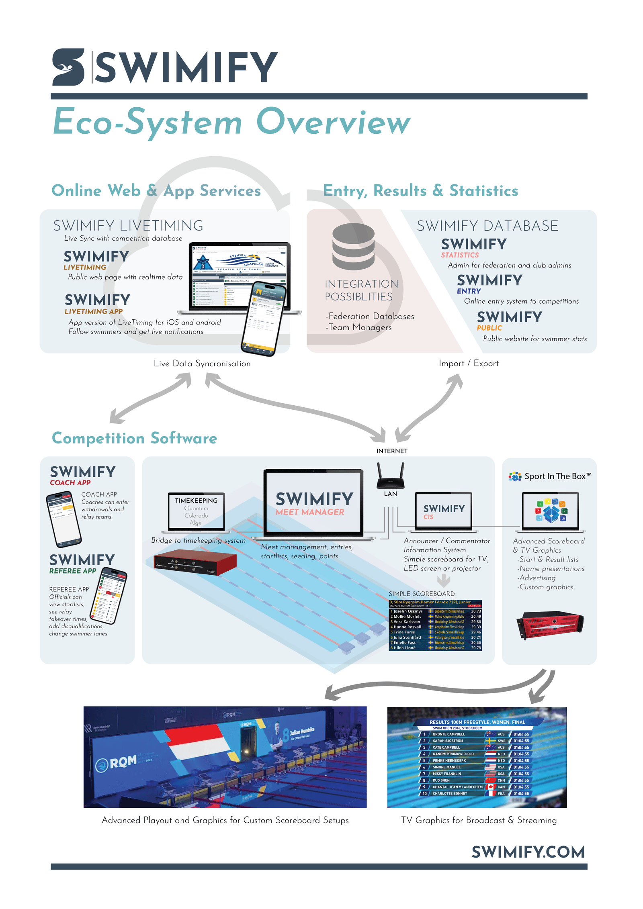
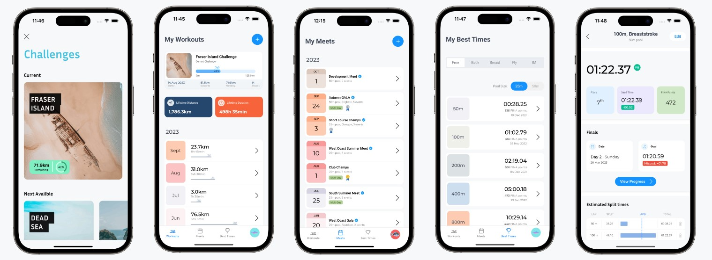
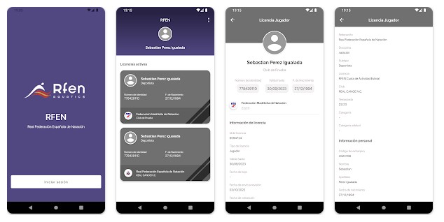
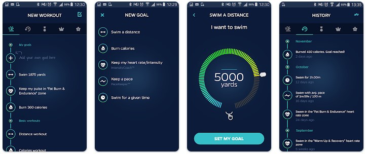

# Estudio del Mercado

## Resumen

El estudio del mercado de SwimChrono se ha realizado con el propósito de analizar el panorama actual de aplicaciones relacionadas con la gestión de competiciones de natación, evaluando la posición de SwimChrono en este mercado y identificando oportunidades y desafíos clave. El alcance del estudio abarca la comparación de SwimChrono con competidores, así como el análisis de tendencias y necesidades del mercado.

## Introducción

SwimChrono ofrece una solución integral para la gestión de competiciones de natación, destacando por su interfaz intuitiva, integración con tecnologías como NFC y Bluetooth, y funcionalidades sociales que fomentan la interacción entre los participantes.

## Análisis del Mercado

### Competidores

#### Swimify

- **Descripción:** Swimify es una plataforma de gestión de competiciones de natación que ofrece una experiencia eficiente y sin papel a través de diversas aplicaciones para nadadores, entrenadores, árbitros y comentaristas. 
- **URL:** <https://www.swimify.com/>
- **Fortalezas:** Cuenta con un Meet Manager que es una aplicación de escritorio para la organización de las competiciones. Swimify CIS para tratamiento de datos en tiempo real y dos aplicaciones para entrenadores y árbitros.
- **Debilidades:** Para obtener alguna de estas aplicaciones es necesario contratar el ecosistema completo, siendo un servicio muy costoso y diseñado para competiciones muy grandes que son retrasmitidas.
  
{width=500}

#### Swimpion

- **Descripción:** Swimpion es una aplicación que permite el registro de entrenamientos, objetivos y comparar esos resultados con otros nadadores. Está orientada a una aplicación uni-personal para mejora de hábitos y registro de datos personales.
- **URL:** <https://swimpion.com/>
- **Fortalezas:** Está dirigida a padres, entrenadores o nadadores adultos y permite la comparación entre otros usuarios. Permite la creación de eventos dentro de la aplicación para vincular los datos registrados a esos eventos en lugar de a los entrenamientos.
- **Debilidades:** No cuenta con funcionalidades de creación y gestión de clubes de natación. Tampoco cuenta con funcionalidades de cronometraje y descalificaciones para árbitros dentro de las competiciones.

#### RFEN App

- **Descripción:** Aplicación Oficial de la Real Federación Española de Natación que permite ver los datos de los usuarios federados a través de una identificación de acceso. En esta aplicación podremos ver las competiciones oficiales a las que nos hemos presentado y los tiempos oficiales que han registrado los árbitros.
- **URL:** <https://play.google.com/store/search?q=rfen&c=apps>
- **Fortalezas:** Consulta de licencia y visualización de tiempos y clubes a los que pertenece el usuario. Ofrece un QR para poder identificarse de forma rápida en las competiciones y permite la inscripción desde la aplicación móvil a las competiciones oficiales
- **Debilidades:** No cuenta con funcionalidades a la hora de la gestión de nadadores, clubes, tiempos o competiciones

#### Swimmo

- **Descripción:** Swimmo es un reloj inteligente diseñado específicamente para nadadores, que ofrece características únicas para mejorar el rendimiento y la experiencia de entrenamiento en la piscina. Además, su aplicación dedicada ofrece análisis detallados de las sesiones de natación y la capacidad de establecer objetivos personalizados para cada sesión.
- **URL:** <https://www.swimmo.com/>
- **Fortalezas:** Proporciona información detallada sobre el rendimiento de natación, incluyendo número de vueltas, distancia, ritmo, duración, frecuencia cardíaca y calorías quemadas. Permite establecer objetivos personalizados para cada sesión de entrenamiento y ofrece seguimiento y análisis detallado del progreso a lo largo del tiempo. Integración con otras aplicaciones de fitness/running para tener todas las actividades deportivas en un solo lugar.
- **Debilidades:** No cuenta con funcionalidades a la hora de la gestión de nadadores, clubes, tiempos o competiciones

### Tabla comparativa

Esta tabla proporciona una comparación básica entre SwimChrono y los principales competidores en términos de características clave, como ...

| Características / Competidores | SwimChrono | Swimpion    | RFEN App | Swimmo |
|--------------------------------|------------|----------   |----------|--------|
| Precio                         | Gratis     | Pago        | Gratis (Solo federados)   | Pago |
| Dispositivo asociado externo   | No         | No          | No       | Sí     |
| Plataformas Soportadas         | Android    | Android,iOS | Android, iOS  | Android, iOS |
| Gestión de Clubes/Torneos      | Sí         | Si          | No       | No     |
| Exportación de Datos           | Excel, CSV | Si          | No       | No     |
| Integración NFC/QR             | Sí         | No          | Sí (para identificación en competiciones) | No     |
| Integración Bluetooth          | Sí         | No          | No       | No     |
| Funcionalidades Sociales       | Sí         | No          | No       | Si     |
| Interfaz Intuitiva             | Sí         | Sí          | Sí       | Sí     |
| Autenticación                  | Email, Redes Sociales    | Si | Sí (requiere acceso federado) | Si |
| Idiomas                  | Castellano, Inglés, Gallego    | Inglés | Español, Inglés | Inglés |

## Tendencias del Mercado

El mercado de aplicaciones relacionadas con la gestión de competiciones de natación está experimentando varias tendencias actuales y emergentes. Entre estas tendencias se encuentran:

- Mayor adopción de tecnología móvil para la gestión y seguimiento de competiciones.
- Integración de funcionalidades avanzadas, como la sincronización en tiempo real y el análisis de datos, para mejorar la experiencia de los usuarios.
- Enfoque en la accesibilidad y la inclusión, con soluciones diseñadas para nadadores de todos los niveles y capacidades.
- Mayor énfasis en la colaboración y la interacción social, permitiendo a los participantes compartir sus experiencias y resultados con otros.

## Oportunidades y Desafíos

### Oportunidades

- Ampliar la presencia de SwimChrono en nuevas plataformas y mercados, aprovechando la creciente demanda de soluciones digitales para la gestión de competiciones de natación a nivel Español Y Gallego.
- Mejorar la integración con tecnologías emergentes, como la inteligencia artificial y el aprendizaje automático, para ofrecer funcionalidades más avanzadas y personalizadas.
- Colaborar con federaciones y organizaciones deportivas para desarrollar soluciones específicas que satisfagan las necesidades del sector y amplíen el alcance de SwimChrono.

### Desafíos

- Competencia en un mercado saturado con varias aplicaciones y soluciones disponibles, lo que requiere diferenciarse y ofrecer un valor único para atraer y retener usuarios.
- Garantizar la seguridad y la privacidad de los datos de los usuarios, especialmente en un entorno donde la protección de la información personal es cada vez más importante.
- Adaptarse a las necesidades cambiantes de los usuarios y mantenerse al día con las últimas tendencias y tecnologías para seguir siendo relevante en un mercado dinámico y en evolución.

## Conclusiones

En conclusión, el estudio del mercado de SwimChrono revela una serie de oportunidades prometedoras para su crecimiento y éxito en el mercado de aplicaciones relacionadas con la gestión de competiciones de natación. Al aprovechar las tendencias emergentes, abordar los desafíos identificados y capitalizar las oportunidades disponibles, SwimChrono puede fortalecer su posición como una solución líder en la industria.