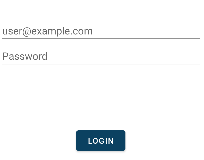
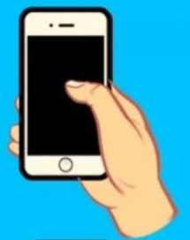
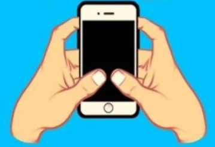
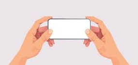
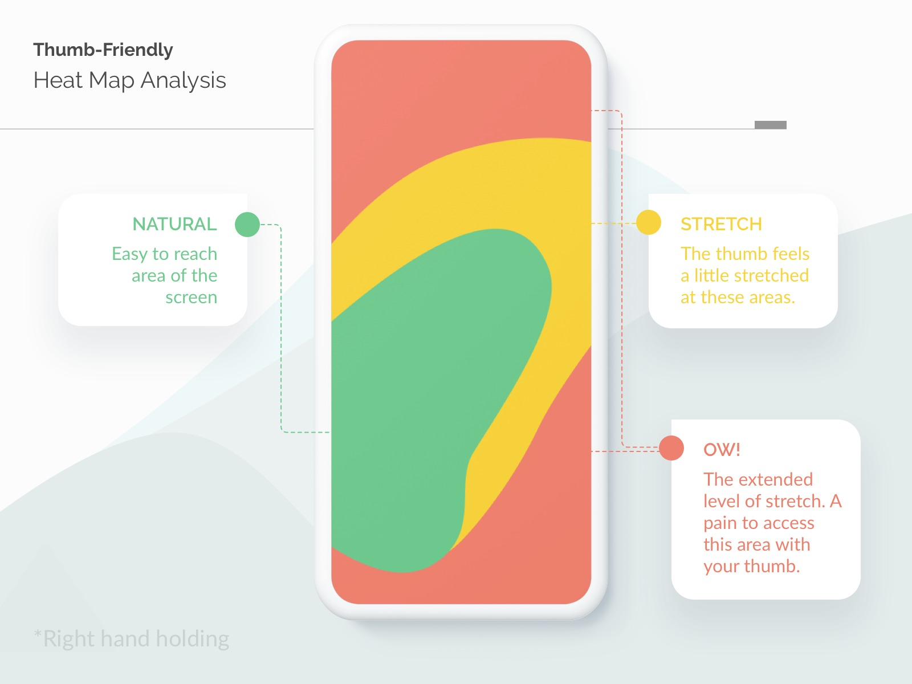

# Usabilidad y UX

## Decisiones de diseño

En la fase de diseño se han tenido en cuenta estos puntos sobre accesibilidad (a11y):

- Se ha escogido una tipografía que no dificulta la lectura.
- Se ha elegido una [paleta de colores](#hoja-de-estilos) que permite altos contrastes y evita que los textos queden poco visibles. A nivel de código, el tema y los colores empleados se definen en los ficheros [_themes.xml_](https://github.com/dfr99/SwimChrono/blob/main/app/SwimChrono/app/src/main/res/values/themes.xml) y [_colors.xml_](https://github.com/dfr99/SwimChrono/blob/main/app/SwimChrono/app/src/main/res/values/colors.xml), respectivamente.
- Se ha configurado tanto el tema Claro como el tema Oscuro.
- Se han añadido tags ARIA en las imágenes para que los lectores de pantalla puedan describir dichas imágenes.

En cuanto a internacionalización (i18n), se ha creado un fichero [_strings.xml_](https://github.com/dfr99/SwimChrono/blob/main/app/SwimChrono/app/src/main/res/values/strings.xml) que permite a la aplicación obtener el texto que se debe mostrar en pantalla en el idioma preferido del usuario.

También en el apartado ajustes de la aplicación se ha facilitado un _RadioButton_ para poder seleccionar el idioma preferido.

## Detección de mejoras

A día 2 de mayo de 2024, se han detectado las siguientes mejoras de usabilidad para la aplicación SwimChrono:

- El _login_ de nuestra aplicación. Algo deseable sería añadir opciones de _login_ con otros servicios, como por ejemplo, Google.

{ width="300" height="150" style="display: block; margin: 0 auto" }

- Sería interesante implementar gestos en la aplicación. Por ejemplo, a la hora de deslizar para navegar entre las diferentes pantallas o volver atrás.

## Utilización del dispositivo

Con respecto a la sujección del dispositivo por parte del usuario cuando este está utilizando la aplicación, se asume lo siguiente:

- En disposición vertical, el dispositivo se sostiene con una o dos manos, operando con la aplicación con el dedo pulgar, como se muestra en estas imágenes.

{ width="200" height="150" style="display: block; margin: 0 auto" }

{ width="400" height="300" style="display: block; margin: 0 auto" }

- En disposición horizontal, el dispositivo se sostiene con las dos manos, operando también con los dos pulgares, como se muestra en la siguiente imagen

{ width="400" height="300" style="display: block; margin: 0 auto" }

Por lo tanto, los componentes de la pantanlla han sido colocados para que stisfagan el mapa de calor de un dispositivo móvil con esa sujección.

{ width="600" height="400" style="display: block; margin: 0 auto" }

## Material Design

Durante el desarrollo de la aplicación SwimChrono se ha aplicado _Material Design_ en los siguientes apartados:

- Todas las tarjetas de club, competiciones y listas de los deportistas se implementan con el elemento [_MaterialCardView_](https://m2.material.io/components/cards). Las tarjetas cumplen los siguientes principios:
 	- Una tarjeta es identificable como un unidad única contenida.
 	- Una tarjeta no puede ser unida con otra tarjeta ni separada en múltiples tarjetas.
 	- Una tarjeta es independiente del contexto que la rodea.

- Por defecto, los elementos _Button_ que se utilizan en la aplicación utilizan a bajo nivel el elemento [_MaterialButton_](https://m2.material.io/components/buttons). Estos botones cumplen, por diseño, los siguientes principios:
 	- Son identificables e indican de forma clara que pueden iniciar acciones.
 	- Son fácilmente localizables entre los demás elementos de la aplicación.
 	- La acción de un botón y su estado son claros.

- Se utiliza el elemento [_BottomNavigation_](https://m2.material.io/components/bottom-navigation) . Por diseño, este elemento cumple los siguientes principios:
 	- Es ergónomico: sus secciones son fácilmente alcanzables para el usuario.
 	- Cuando es utilizado, _BottomNavigation_ aparece en la parte inferior de todas las pantallas de forma consistente.
 	- Las secciones de _BottomNavigation_ son igual de importantes. En nuestro caso, a través de este elemento se accede a la pantalla principal de cada una de las funcionalidades disponibles en la aplicación salvo el cronómetro. Esta última depende de tener carreras registradas en ese momento, por lo que se considera en otro orden.

## Feedback de los usuarios

Tras exponen la aplicación a potenciales usuarios de la misma, se ha recopilado la siguiente información:

- Se debe mostrar el número total de carreras, tanto en la pantalla de _Dashboard_ como en la pantalla.
- Ajustar la distancia entre elementos para no saturar algunas pantallas. Se destaca la pantalla de **Carreras**.
- Añadir más gestualidad a la aplicación.
